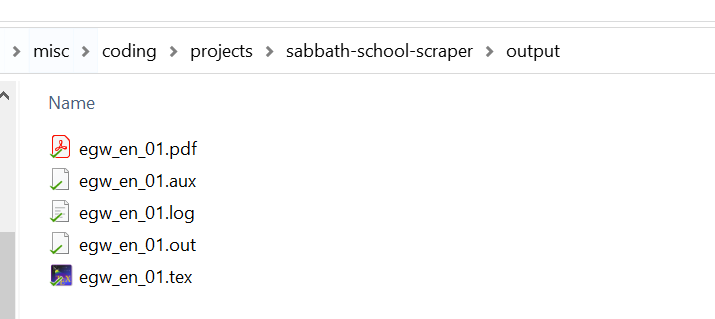

# Ellen G. White Comments Scraper

Simple crude script to scrape the Ellen G. White comments from the <a href="https://sabbath-school.adventech.io/">Sabbath School website</a> and compile the data into PDF-files via `pdflatex`.

## Features

- Automatic multiprocessor scraping of Sabbath School website for EGW-comments
- Saves  the data into `*.tex` files
- Compiles the `*.tex` files into PDFs using `pdflatex`
- Supports multiple langues (English, French and German), additional languages can be added optionally

## Screenshots

### Settings

### Output

 

