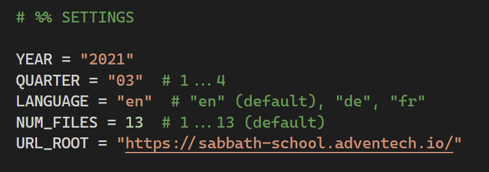

# Ellen G. White Comments Scraper

Simple crude script to scrape the Ellen G. White comments from the <a href="https://sabbath-school.adventech.io/">Sabbath School website</a> and compile the data into PDF-files via `xelatex`.

## Features

- Automatic multiprocessor scraping of Sabbath School website for EGW-comments.
- Saves  the data into `*.tex` files.
- Compiles the `*.tex` files into PDFs using `xelatex`.
- Supports multiple languages (English, French and German), additional languages can be added optionally.

## Installation

1. Install a local Python env according to `requirements.txt`.
2. Install LaTeX with xelatex.
3. Install the fonts in the `fonts/` folder or change the font settings  `options.tex`.

## Screenshots

### Settings

### Output

 

